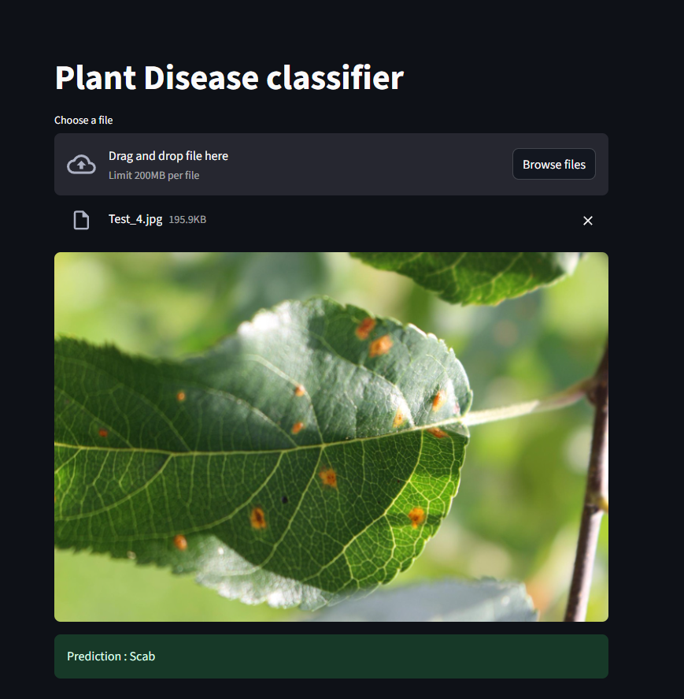

# This project was developed as part of the Celebal Summer Internship.

<h1>Plant Disease Classifier

<h3> Problem Statement : 
Identify the category of foliar diseases in apple trees </h3>

<h5>There are 4 categories

<li>Healthy
<li>Multiple diseases
<li>Rust
<li>Scab

<h5>
Preprocessing : Extracting features including:
<li>Mean Brightness
<li>Standard Brightness
<li>Mean Saturation
<li>Standard Saturation
<li>Yellow area fraction
<li>LBP
<li>Numer of blobs

<h5>
Model Used : Experimented with SVC and RandomForestClassifier, RFC achieved higher accuracy than SVC

Final Submission : final_submission.csv